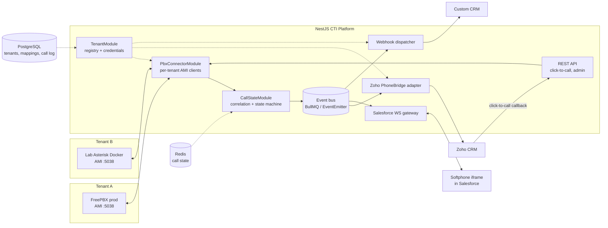
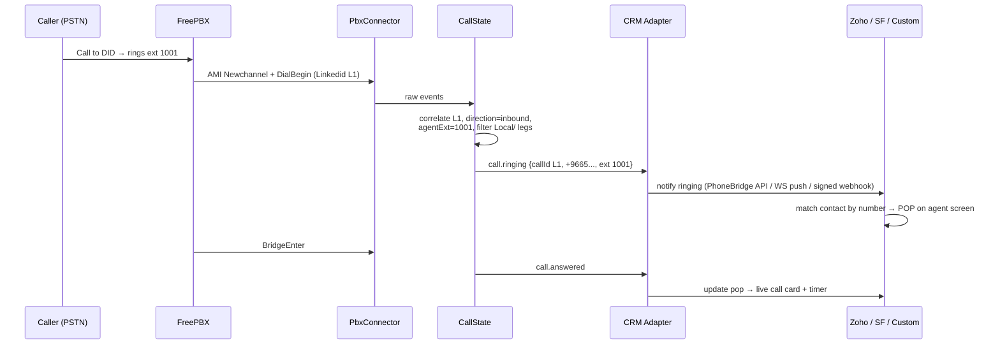
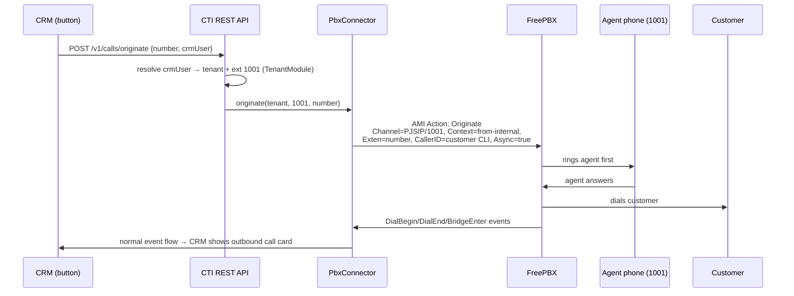
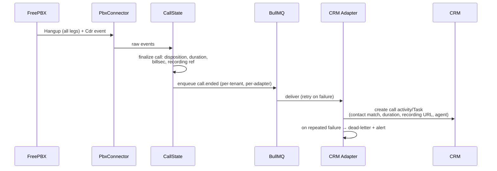
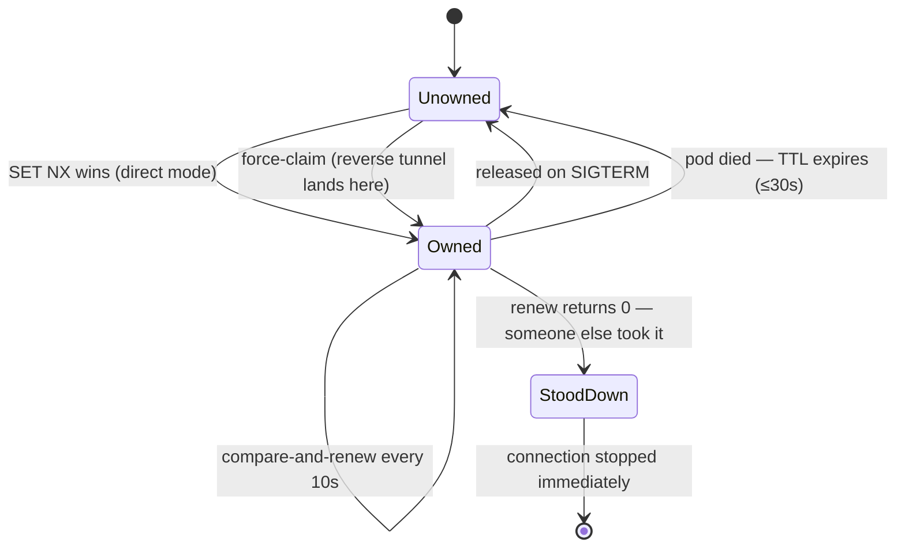
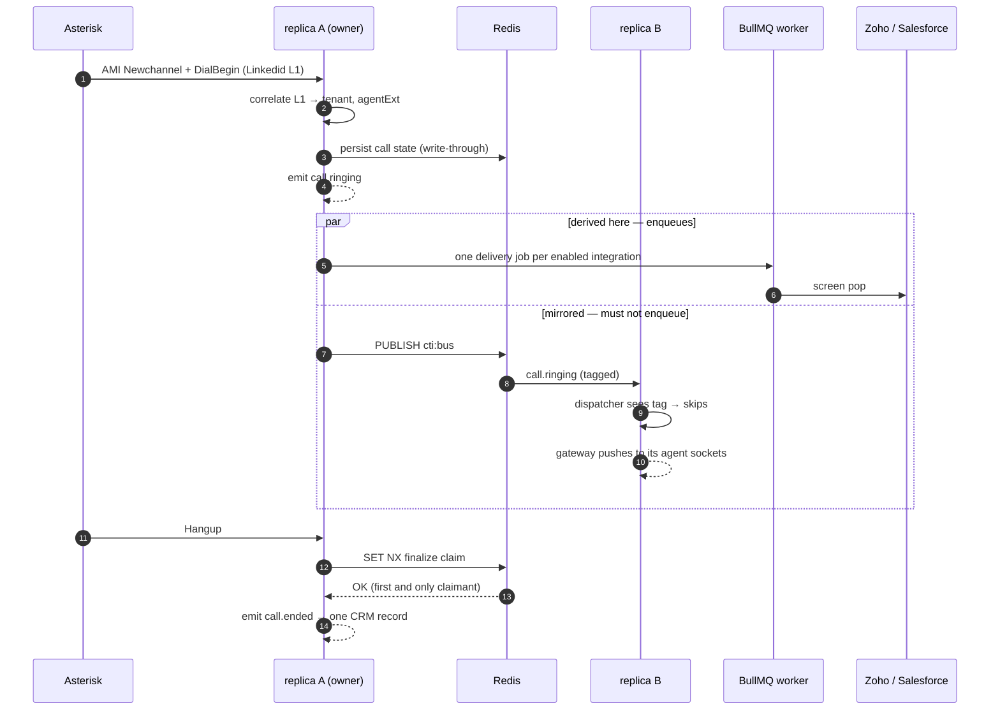
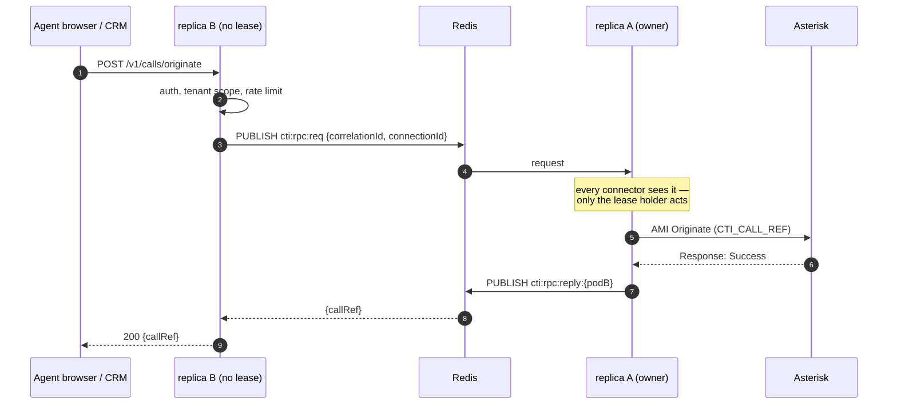
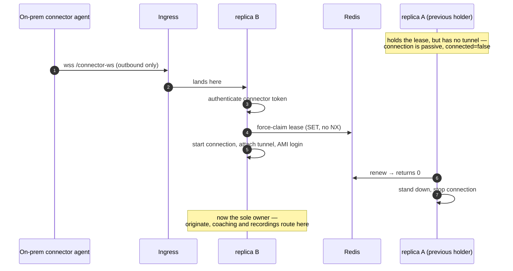
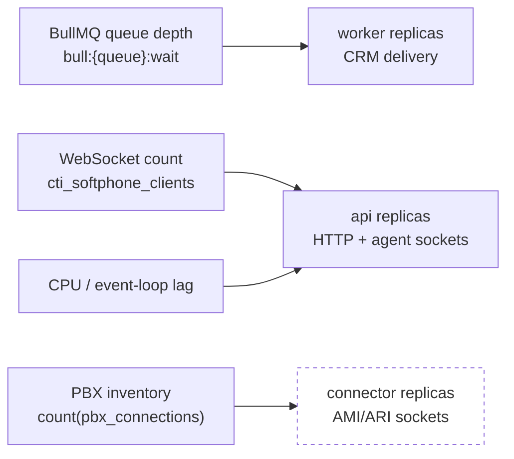

# CTI Platform — Asterisk/FreePBX ↔ CRM Integration

**Knowledge & architecture document** for building a multi-tenant Computer Telephony Integration (CTI) product: click-to-call, screen pops, and automated call logging between Asterisk/FreePBX servers and CRMs (Zoho CRM, Salesforce, and any custom CRM via generic webhooks).

- **Targets:** production FreePBX servers + the lab `Multi-Tenant-Asterisk` Docker project (prototyping)
- **Stack:** a dedicated **NestJS (TypeScript)** application — Redis for live call state, PostgreSQL for the tenant registry
- **Status:** **built and validated through Phase 12c** — the platform is horizontally scalable (§9). For the current feature set see [docs/FEATURES.md](./docs/FEATURES.md), the design decisions in [docs/adr/](./docs/adr/README.md), setup in [docs/INSTALL.md](./docs/INSTALL.md), running more than one replica in [docs/SCALING.md](./docs/SCALING.md), and the live API at `/docs`. (This began as a design doc; it now doubles as the architecture explainer.)
- **See it whole:** [docs/architecture.html](./docs/architecture.html) is an interactive diagram of the built system — every component in this document as a clickable box, plus seven traceable call flows (inbound screen pop, click-to-call, call logging, restart resync, supervisor coaching, firewalled PBX, ARI routing). Self-contained; open it in any browser.

> **As-built note.** The design below held up; a few concrete choices diverged from the original sketch and are worth flagging so this document isn't misleading:
> - **AMI client is hand-rolled**, not `asterisk-ami-client`/`asterisk-manager` (the npm libraries are unmaintained; the protocol is ~150 lines — [ADR-0002](./docs/adr/0002-hand-rolled-ami-client.md)). It runs over any transport, which the reverse connector reuses.
> - **CRM adapters are one module per CRM** (`ZohoModule`, `SalesforceModule`, `HubSpotModule`, `DynamicsModule`), not a single `CrmAdaptersModule` with a `CrmAdapter` interface — each follows the same dispatcher/processor/queue shape ([ADR-0006](./docs/adr/0006-crm-adapter-models.md), [ADR-0010](./docs/adr/0010-webrtc-softphone-and-crm-expansion.md)).
> - **ORM is TypeORM** (with real migrations, not `synchronize`); **WebSockets use `ws`** (`@nestjs/platform-ws`), not socket.io; **AMI secrets/CRM tokens are AES-256-GCM** under one master key (`CryptoService`), not libsodium.
> - **Reverse on-prem connector** (customer dials out; no inbound holes) and **recordings pulled over that tunnel** are built ([ADR-0007](./docs/adr/0007-reverse-onprem-connector.md)/[0008](./docs/adr/0008-signed-capability-urls-for-recordings.md)/[0009](./docs/adr/0009-tls-terminating-reverse-proxy-deployment.md)). **WebRTC softphone** (in-browser audio via self-hosted JsSIP) is built; real two-way audio needs a WebRTC-configured PBX. The **ARI connector** and advanced telephony (in-call coaching, queue/ACD wallboard, CRM-driven IVR) are built ([ADR-0011](./docs/adr/0011-ari-advanced-telephony.md)) — the door ADR-0001 left open. The **queue wallboard is verified live**, and note it runs on plain AMI `app_queue` events, *not* Stasis; only coached audio (registered SIP phones) and the ARI/Stasis path itself (`http.conf`/`ari.conf`) remain unexercised live.
> - **This document described a single process until Phase 12.** It was not merely un-tuned for replicas — two replicas produced *two of every CRM record*, because each opened its own AMI socket and independently ran the §3 correlation engine. §9 covers what changed: single-writer ownership by Redis lease, a cluster event bus, and cross-pod command routing ([ADR-0012](./docs/adr/0012-single-writer-ownership-for-horizontal-scale.md)/[0013](./docs/adr/0013-cluster-event-bus-and-exactly-once-enqueue.md)). **All roadmap phases 0–12 are complete.**

---

## 1. What a CTI actually is

A CTI sits between the phone system and the business software and translates in both directions:

- **PBX → CRM:** "extension 1001 is ringing from +9665xxxxxxx" → *pop the matching contact card on the agent's screen*; "the call ended, 4m32s, recorded" → *log an activity on the contact*.
- **CRM → PBX:** agent clicks a phone number → *make the agent's desk phone ring, then dial the customer* (click-to-call).

So the whole product reduces to four capabilities:

1. **Listen** to call events from each PBX in real time.
2. **Correlate** low-level channel events into meaningful *calls* tied to *agents*.
3. **Command** the PBX (originate, and later: transfer, hangup, spy).
4. **Speak each CRM's dialect** for pops, dialing, and logging.

Everything else (multi-tenancy, auth, retries) is plumbing around those four.

---

## 2. The three Asterisk control surfaces

You need to know all three, because the product will end up using a mix.

### 2.1 AMI — Asterisk Manager Interface ✅ *primary choice*

A plain TCP socket (port **5038**) speaking a key/value line protocol. Two roles at once:

- **Event stream** — Asterisk pushes every call lifecycle event: `Newchannel`, `Newstate`, `DialBegin`, `DialEnd`, `BridgeEnter`, `BridgeLeave`, `Hangup`, `Cdr`, `NewCallerid`, plus device/extension state (`DeviceStateChange`, `ExtensionStatus`).
- **Action channel** — you send actions and get responses: `Originate` (click-to-call), `Redirect` (transfer), `Hangup`, `CoreShowChannels`, `ExtensionState`, `Getvar`/`Setvar`.

**Why it's the primary choice for this product:**
- **FreePBX ships with AMI enabled by default** (`manager.conf`, admin user in `/etc/asterisk/manager.conf`). Integrating with a customer's production FreePBX requires only adding a manager user + ACL — **zero dialplan changes**.
- It observes *all* calls on the box regardless of how they were routed. ARI only sees calls that are explicitly sent into a Stasis app.
- Screen pop + click-to-call + logging need observation and origination — exactly AMI's sweet spot.

**Its rough edges (you must design around these):**
- It's a **firehose**: a single 2-leg call emits 20+ events. You filter and correlate (see §3).
- Events are **channel-centric**, not call-centric.
- Auth is username/password with IP ACLs (`permit`/`deny`); TLS exists (port 5039, `tlsenable=yes`) but is often not enabled. **Never expose 5038 to the internet** — see §6.
- Event names/fields changed between Asterisk 12 (pre/post-Stasis-core). Everything modern (13, 16, 18, 20+) is consistent; FreePBX 15/16/17 = Asterisk 16/18/20+, so target the modern schema and don't bother supporting Asterisk ≤11.

### 2.2 ARI — Asterisk REST Interface

HTTP REST + a WebSocket (via Asterisk's built-in HTTP server, port **8088**/8089-TLS, configured in `http.conf` + `ari.conf`). Gives you *full call control*: you become the dialplan — answer, bridge, play media, record, snoop, all from your app (a "Stasis application").

**Why it is not the primary surface here:**
- ARI only receives events for channels **explicitly sent to `Stasis(yourapp)` in the dialplan** → you'd have to modify every customer's FreePBX dialplan and take responsibility for their call routing. That's invasive and risky for a bolt-on CTI.
- For pops/click-to-call/logging you never need to own media or bridging.

**When you'll want it later:** advanced features on PBXs you *do* control — in-call coaching/whisper, dynamic IVR driven by CRM data, call parking UIs. Keep the door open in the connector abstraction, don't build it now.

### 2.3 Dialplan-level hooks (AGI / `CURL()` / custom contexts)

The fallback when you can't get AMI at all (e.g., a hosted provider like Bevatel that won't open 5038):

- `extensions_custom.conf` on FreePBX exposes hook contexts (e.g. `[from-internal-custom]`, macro hooks like `[macro-dialout-trunk-predial-hook]`) where you can add a `CURL()` to notify your middleware, or run an AGI/FastAGI script.
- CDR backends (`cdr_adaptive_odbc`, or FreePBX's MySQL `asteriskcdrdb`) can be polled for after-the-fact logging when real-time isn't possible.

This is lossy (no rich mid-call state) but lets you sell "call logging + basic pop" even on locked-down PBXs. Document it as a degraded connector mode.

### 2.4 Decision summary

| Need | AMI | ARI | Dialplan hooks |
|---|---|---|---|
| See all calls, no dialplan changes | ✅ | ❌ (Stasis only) | ⚠️ partial |
| Click-to-call (`Originate`) | ✅ | ✅ | ⚠️ (call files — hacky) |
| Works on stock FreePBX out of the box | ✅ | ❌ (must enable http+ari) | ⚠️ needs config edits |
| Full call control / media | ❌ limited | ✅ | ❌ |
| **Verdict** | **Primary** | Later, for advanced features | Fallback for locked-down PBXs |

---

## 3. The event problem: from channels to calls

This is the hardest part of any Asterisk CTI and the core IP of the product. Raw AMI gives you *channels*; the CRM wants *calls*.

**Key identifiers on every AMI event:**
- `Uniqueid` — unique per **channel** (one leg).
- `Linkedid` — shared by **all channels belonging to the same call** (set to the Uniqueid of the first channel). **This is your call ID.** Group everything by `Linkedid`.
- `Channel` — e.g. `PJSIP/1001-00000042`; parse the endpoint (`1001`) to map to an agent.
- `CallerIDNum` / `ConnectedLineNum` — the two parties, from that channel's perspective.

**The state machine you must derive per call:**

```
            Newchannel (Linkedid born)
                    │
                    ▼
DialBegin ────► RINGING ── screen-pop event fires here
                    │
        ┌───────────┴──────────────┐
        ▼                          ▼
 BridgeEnter → ANSWERED      Hangup (no bridge) → MISSED / NO ANSWER / BUSY
        │                          │
        ▼                          │
   Hangup (all legs) ──────────────┴──► ENDED → Cdr event → log to CRM
```

**Rules of thumb learned the hard way (bake into the design):**

- **Direction detection:** a call is *inbound to an agent* when the ringing channel's endpoint matches a registered extension and the far end doesn't; *outbound* when the first channel of the Linkedid belongs to an extension. On FreePBX you can also read the context (`from-internal` vs `from-pstn`/`from-trunk`).
- **Ignore noise:** local channels (`Local/...`, used heavily by FreePBX for follow-me/queues) create phantom legs — track them but never surface them as calls. Same for `Announcer/`, `Message/`, music-on-hold bridges.
- **Queues and ring groups** ring N channels for one call: N `DialBegin`s, one `BridgeEnter`, N-1 `Hangup`s with cause 26 (answered elsewhere). Your pop logic must pop for *each ringing agent* and retract the pop (or mark "answered by X") when someone else takes it. AMI's `AgentCalled`/`AgentConnect` (app_queue events) help for true queues.
- **Transfers** re-parent channels: on blind/attended transfer, watch `BlindTransfer`/`AttendedTransfer` events — the Linkedid survives, but the agent mapping changes mid-call.
- **The `Cdr` event** (or `CEL` for finer grain) arrives at hangup with duration, billsec, disposition, and — on FreePBX — the recording filename in the `recordingfile` field of the CDR DB. This is your logging trigger.
- **State reconciliation:** on (re)connect, run `CoreShowChannels` to rebuild in-flight call state; never assume the event stream is gapless. Keep call state in **Redis with a TTL** (e.g., 6h) so a crashed worker doesn't leak "stuck" calls.

**The output of this layer is a small normalized event vocabulary** that every CRM adapter consumes:

```
call.ringing   { callId, tenantId, direction, agentExt, remoteNumber, remoteName?, startedAt }
call.answered  { callId, tenantId, answeredAt }
call.ended     { callId, tenantId, direction, agentExt, remoteNumber, disposition,
                 durationSec, billsecSec, startedAt, endedAt, callRef?, recordingUrl? }
agent.state    { tenantId, ext, state, at }     // presence (RINGING/INUSE/NOT_INUSE/UNAVAILABLE)
```

---

## 4. What each CRM expects

Three very different integration models — this is why the adapter layer must be a real abstraction, not an `if/else`.

### 4.1 Zoho CRM — PhoneBridge (server-side push)

- Zoho's telephony framework: you register as a **PhoneBridge partner/integration**, then your *server* calls Zoho's PhoneBridge REST APIs.
- **Screen pop:** you POST a "call notify" (ringing/answered/ended) to PhoneBridge with the caller number; **Zoho does the contact matching and renders the pop** inside Zoho CRM. You don't build UI.
- **Click-to-call:** Zoho shows the dial icon; clicking it makes Zoho call **your registered callback endpoint** with the number + Zoho user → you resolve Zoho user → agent extension → AMI `Originate`.
- **Logging:** call-ended notify auto-creates the call activity; you can enrich via the regular Zoho CRM REST API (attach recording link, notes).
- **Auth:** OAuth2 per customer org (authorization code flow, refresh tokens). Store per-tenant tokens encrypted; Zoho tokens are org+DC-scoped (`.com`, `.eu`, `.sa` DCs — Saudi DC exists and matters for your market).
- **Mapping requirement:** a table of *Zoho user ID ↔ agent extension* per tenant.

### 4.2 Salesforce — Open CTI (client-side softphone)

The inverse model: **you build the UI**, Salesforce hosts it.

- You create a **Call Center definition** (XML) pointing at a softphone page you host; admins assign users to it. Salesforce renders your page in an iframe (the softphone panel in Lightning).
- Your softphone page loads Salesforce's **Open CTI JS library** and talks to *your* NestJS backend over **WebSocket** for real-time events.
- **Screen pop:** on `call.ringing` for that agent, your page calls `sforce.opencti.searchAndScreenPop({ searchParams: callerNumber, ... })` — Salesforce searches its own records and pops.
- **Click-to-call:** `sforce.opencti.enableClickToDial()` + `onClickToDial(listener)` — Salesforce sends the clicked number to your page → your page hits your REST API → AMI `Originate`.
- **Logging:** your backend (or the page) creates a `Task` of type Call via the Salesforce REST API on `call.ended` (subject, duration, disposition, recording link, `WhoId` = matched contact).
- **Auth:** OAuth2 (per-org connected app) for the REST logging; the softphone page itself is authenticated by your own session (agent logs into your CTI once).
- **Mapping requirement:** *Salesforce user ↔ agent extension* per tenant.

### 4.3 Generic webhooks + REST (custom CRMs) — build this first

The lowest common denominator, and the fastest path to a demo:

- **Outbound:** signed `POST` per normalized event (`call.ringing`, `call.answered`, `call.ended`) to a per-tenant webhook URL. HMAC-SHA256 signature header (`X-CTI-Signature`), timestamp header, retries with exponential backoff + dead-letter (BullMQ).
- **Inbound:** `POST /v1/calls/originate { agentExt | agentId, number }` with per-tenant API key → AMI `Originate`. Plus `GET /v1/calls/:id` and `GET /v1/agents/:ext/state`.
- A custom CRM implements a pop with a 20-line webhook receiver + a browser push (or polls). This surface is also *exactly* what Phases 3–4 adapters consume internally — Zoho/Salesforce adapters are just privileged webhook consumers.

---

## 5. Architecture — the NestJS application

### 5.1 Topology (logical)

> This is the **logical** view — how the modules relate, drawn as a single process for clarity. It is still accurate about what talks to what. For the **deployment** view, where the platform runs as several replicas and exactly one of them drives each PBX, see [§9 Running at scale](#9-running-at-scale) and [docs/SCALING.md](./docs/SCALING.md).



### 5.2 Module breakdown

*(As shipped — module names/tech match the code.)*

| Module | Responsibility | Key tech |
|---|---|---|
| `PbxConnectorModule` | One supervised AMI connection per PBX (direct dial-out **or** reverse tunnel): connect, auth, keepalive, reconnect w/ backoff; `ResyncService` runs `CoreShowChannels` on (re)connect; `ReverseConnectorGateway` + `ConnectorFilesModule` for on-prem agents; `Originate` execution | hand-rolled `AmiClient` (any transport), Nest lifecycle hooks |
| `CallStateModule` | Linkedid grouping, state machine (§3), Local-channel filtering, direction detection; write-through to Redis (TTL); emits the normalized vocabulary | `ioredis` (call state, TTL), `@nestjs/event-emitter` |
| `TenantsModule` | Tenant registry: PBX credentials (encrypted), CRM configs/tokens, agent↔extension↔CRM-user mappings + SIP creds, webhook URLs + signing secrets, hashed API keys; `CryptoService` (AES-256-GCM) | PostgreSQL via **TypeORM (migrations)**, `@nestjs/config` |
| `WebhooksModule` + per-CRM modules (`ZohoModule`, `SalesforceModule`, `HubSpotModule`, `DynamicsModule`) | Each: dispatcher (`@OnEvent(call.*)`) → durable queue → processor that talks to the CRM; per-tenant fan-out; enabled only for tenants with that integration | BullMQ (`@nestjs/bullmq`) queue per surface |
| `ApiModule` / `AdminModule` | REST: `/v1/calls/originate`, call/agent-state queries; admin CRUD + hot-reload + dead-letter retry; Zoho click-to-call callback | Nest controllers, guards (tenant/admin key, agent JWT, throttler) |
| `SoftphoneModule` (`SoftphoneGateway`) | `ws` gateway pushing each agent's `call.*` + `agent.state`; agent login/JWT; WebRTC config; serves the softphone page + self-hosted JsSIP | `@nestjs/platform-ws` (`ws`) |
| `RecordingsModule` / `PresenceModule` / `ObservabilityModule` | Signed recording URLs (local mount or over the tunnel); `agent.state` presence; structured logs, Prometheus `/metrics`, `/health/live`+`/ready`, dead-letter alerts | `prom-client`, `ioredis` |

**Design rules:**
- Adapters consume **only** the normalized events — no AMI types leak past `CallStateModule`.
- All CRM delivery goes through **BullMQ** (Redis-backed) so a CRM outage never blocks event processing; retries + dead-letter per tenant.
- The connector is an internal interface (direct + reverse AMI implementations today) — leaves room for an ARI connector (Phase 11) without touching anything downstream.

> **The three flows below are module-level**, drawn within one process so the telephony logic stays legible. They remain accurate about the order of operations. What they do not show is *which replica* performs each step when the platform runs more than one — for that, see [§9.3](#93-an-inbound-call-with-three-replicas) and [§9.4](#94-click-to-call-from-a-replica-that-does-not-own-the-pbx).

### 5.3 Flow 1 — inbound call → screen pop



### 5.4 Flow 2 — click-to-call

The **agent-leg-first** pattern: originate to the *agent's phone* first; when the agent picks up, Asterisk dials the customer. The agent never hears dead air and the CLI presented to the customer is correct.



Notes: `Async: true` is mandatory (otherwise the AMI action blocks until answer); set `ChannelId`/`OtherChannelId` or a `Variable: CTI_CALL_REF=...` so the resulting channels are attributable to the API request; on FreePBX originate into `from-internal` so outbound routes/recording apply normally.

### 5.5 Flow 3 — call end → automated logging



Recording links: FreePBX stores recordings under `/var/spool/asterisk/monitor/...` with the filename in the CDR. Serve them through a small authenticated proxy endpoint on the CTI (per-tenant signed URLs) rather than exposing the PBX.

### 5.6 Multi-tenancy model

- **Tenant registry (PostgreSQL):** tenant → N PBX connections (host, AMI port, username, encrypted secret, TLS mode) → N agents (extension, display name, per-CRM user IDs) → CRM configs (type, OAuth tokens / webhook URL + HMAC secret / API keys).
- **Connection isolation:** one AMI client per PBX, supervised (Nest lifecycle + reconnect backoff + health state exposed on `/health`). A misbehaving tenant PBX must not affect others — wrap each connector in its own error domain; consider per-tenant worker processes only if scale demands it later.
- **Event routing:** every internal event carries `tenantId` from the connector that produced it; adapters look up tenant CRM config at delivery time.
- **The NAT problem (important for productization):** customer FreePBX boxes are usually behind NAT/firewalls — the cloud CTI can't reach 5038. Two deployment modes to support:
  1. **Direct** — customer opens 5038/5039-TLS to your static IPs (ACL'd) or you peer via VPN/WireGuard. Fine for early customers.
  2. **Reverse connector (later)** — a tiny on-prem agent (could be a single binary or container) that dials *out* to the cloud over TLS/WebSocket and proxies AMI. This is how commercial CTIs solve it; design the `PbxConnector` interface so this slots in.

---

## 6. Security checklist

- **AMI:** dedicated manager user per integration with **minimal `read`/`write` classes** (`read = call,cdr,dialplan,dtmf,agent`, `write = originate,call,reporting` — not `all`; `agent` on read gates the queue events, `reporting` on *write* gates the `CoreShowChannels` action behind the resync — Asterisk authorises actions against write perms, events against read perms); `permit` ACLs pinned to the CTI's IPs; prefer TLS (5039) or VPN; never expose 5038 publicly (it's a remote-code-execution surface via `Originate`+`System` if `write=system` is granted — never grant it).
- **Secrets at rest:** PBX passwords and CRM OAuth refresh tokens encrypted (per-tenant data key, e.g. libsodium sealed boxes); never in env files per tenant.
- **Webhooks out:** HMAC-SHA256 signature + timestamp (reject >5min skew) so customer CRMs can verify authenticity.
- **API in:** per-tenant API keys (hashed at rest) for the generic REST; JWT sessions for softphone WebSocket auth; rate-limit `originate` (it makes phones ring — abuse vector).
- **Recordings:** served only via short-lived signed URLs through the CTI proxy; PBX filesystem never exposed.
- **Multi-tenant hygiene:** every query and every event handler filters by `tenantId`; write tests specifically for cross-tenant leakage.

---

## 7. Roadmap

| Phase | Scope | Exit criterion |
|---|---|---|
| **0 — Lab prep** | Add `manager.conf` (+ expose 5038) to `LAB/Multi-Tenant-Asterisk` Docker config; create a `cti` manager user with minimal ACLs | `telnet localhost 5038` login works; events visible on a test call between 1001↔1002 |
| **1 — Core (single tenant)** | Scaffold NestJS app in `LAB/CTI/`; `PbxConnectorModule` + `CallStateModule` + normalized events; generic webhook dispatcher; `POST /v1/calls/originate` | Demo: call 1001→1002 fires signed webhooks; curl originates a call; webhook consumer shows a pop |
| **2 — Multi-tenant + production FreePBX** | Tenant registry (PostgreSQL), encrypted creds, BullMQ delivery, `/health`, agent↔extension mapping, point at a real FreePBX | Two tenants (lab + prod FreePBX) running concurrently, isolated, with per-tenant webhooks |
| **3 — Zoho PhoneBridge** | OAuth per org, call-notify integration, click-to-call callback endpoint, activity enrichment | Ringing pop inside Zoho; dial icon in Zoho rings the agent's phone; ended call logged |
| **4 — Salesforce Open CTI** | Softphone page + Call Center XML, `SoftphoneGateway` WebSocket, `searchAndScreenPop`, click-to-dial, Task logging | Same three features working inside Salesforce Lightning |
| **5 — Productization** | Reverse on-prem connector, recording proxy, admin UI, per-tenant dashboards, presence (`agent.state`) | Installable at a customer without inbound firewall holes |

> **What's next:** **all roadmap phases 0–11 are complete** (and validated). Per-phase status: [docs/ROADMAP.md](./docs/ROADMAP.md).

### Libraries used (as built)

- AMI: **hand-rolled** `AmiClient` (ADR-0002) — the npm libraries are unmaintained and can't run over the reverse tunnel.
- Queue: `@nestjs/bullmq` + BullMQ; Events: `@nestjs/event-emitter`.
- DB: **TypeORM** + PostgreSQL (migrations, not `synchronize`); Redis via `ioredis`.
- WebSocket: `@nestjs/websockets` + **`ws`** (`@nestjs/platform-ws`). WebRTC softphone: self-hosted **JsSIP**. Metrics: `prom-client`.

---

## 8. Open questions — resolution

1. **Zoho PhoneBridge partner registration** — *still open (operational).* The adapter is built and mock-verified; going live needs Zoho partner access + a refresh token, then reconcile payloads in `zoho-client.ts`. See [INSTALL §11](./docs/INSTALL.md).
2. **Salesforce org access** — *still open (operational).* Adapter + Call Center XML built; needs a real connected app in the customer org.
3. **CLI/CallerID policy per tenant** — resolved: the CTI presents the destination number on the agent leg and relies on the PBX's trunk rules for outbound CLI; per-tenant `originateChannelTemplate`/`originateContext` are in the registry.
4. **Data residency** — resolved in design: Zoho DC base URLs are per-integration (`.com`/`.eu`/`.sa`), recordings never leave the CTI proxy; hosting location remains a deployment choice.

---

## 9. Running at scale

*(Phase 12a. Rationale: [ADR-0012](./docs/adr/0012-single-writer-ownership-for-horizontal-scale.md) for ownership, [ADR-0013](./docs/adr/0013-cluster-event-bus-and-exactly-once-enqueue.md) for the event bus. Operator guide: [docs/SCALING.md](./docs/SCALING.md).)*

Everything above describes one process. This section describes what changes when there are several — and it is not a tuning exercise. **Before Phase 12, two replicas produced two of every CRM record**, because each opened its own AMI socket to the same PBX and independently ran §3's correlation engine.

### 9.1 The invariant

**A PBX connection is driven by exactly one replica at a time.** That replica is the sole source of `call.*` events for its PBX, and the only one that enqueues delivery. Everything else in this section follows from that sentence.

Ownership is a Redis lease: a key holding the pod's identity under a 30s TTL, renewed every 10s, released on `SIGTERM`, with renewal and release as Lua compare-and-swap against the pod id. A process away longer than the TTL can never reclaim ownership someone else has taken.



The two connection modes claim ownership differently, and must:

- **`direct`** — lease-first. Any replica can dial the PBX, so first `SET NX` wins.
- **`reverse`** — **tunnel-first.** The customer's connector agent dials out and lands wherever the load balancer puts it. That replica force-claims, because the connection can only be served where the socket physically is; the previous holder has no tunnel and stands down.

### 9.2 Why a second mechanism was needed

Ownership alone is not sufficient, and this is the part that surprises people.

Once a single replica owns a connection, the pod holding an agent's WebSocket is almost never the pod that derived the event — so `call.*` must be mirrored to every replica over Redis pub/sub, or screen pops stop. But mirroring means every replica's dispatchers see the event again. **Measured live, with ownership already working and only one AMI socket: two delivery jobs per event.**

So there are two rules, not one:

| Rule | Enforced by |
|---|---|
| Only one replica may **derive** an event | Redis lease |
| Only the deriving replica may **enqueue** delivery | `Symbol` marker on mirrored payloads, checked by all five dispatchers |

### 9.3 An inbound call with three replicas



`call.ended` takes its own `SET NX` claim because a lease handover can briefly leave two replicas holding the same call — the outgoing owner mid-hangup and the incoming one having hydrated it from Redis. The claim is a *separate* key rather than "did our `DEL` remove the snapshot": persistence is fire-and-forget, so a snapshot that had not landed yet would make `DEL` report 0 and silently swallow a real call log.

### 9.4 Click-to-call from a replica that does not own the PBX

The request lands wherever the load balancer put it. For a reverse connection the socket is pinned to whichever replica the customer's agent dialled into, so the command has to travel.



The RPC timeout (15s) is deliberately longer than the AMI action timeout (10s) so the PBX's own error text propagates rather than a generic "no reply".

### 9.5 A reverse tunnel landing on the "wrong" replica



### 9.6 What is shared

| State | Key | Purpose |
|---|---|---|
| Ownership | `cti:lease:{ami\|files}:{connectionId}` | the exclusivity guarantee |
| Call state | `call:{connectionId}:{callId}` (6h) | `GET /v1/calls` correct cluster-wide, survives restart |
| Finalize claim | `cti:finalized:{connectionId}:{callId}` (5m) | `call.ended` exactly once |
| Presence | `cti:presence:{tenantSlug}` hash (24h) | same answer on every replica |
| Queue stats | `cti:qstats:{connectionId}:{queue}` (24h) | wallboard survives a handover |

Two sockets are leased separately (`ami`, `files`) because a connector agent opens `/connector-ws` and `/connector-files` independently and they can land on different replicas.

**Redis becomes a correctness dependency, not a cache** — leases live there. It must be HA before production. That is the real cost of this design.

### 9.7 Scaling signals

The three concerns scale on different signals, which is why they are separate workloads (`CTI_ROLE=api|connector|worker`) rather than identical replicas. Deployed by [deploy/helm/cti](./deploy/helm/cti); see [docs/INSTALL.md §15](./docs/INSTALL.md).



Note the asymmetry: **connectors scale with inventory, not load.** A PBX has a fixed number of AMI sessions worth opening, so adding connector replicas under call load would be useless at best. Only `api` and `worker` are demand-driven.

`cti_queue_jobs` is deliberately absent from the diagram: it is derived from Redis, so every replica reports the same global number and summing it across pods multiplies by replica count. KEDA reads queue depth from Redis directly instead.
