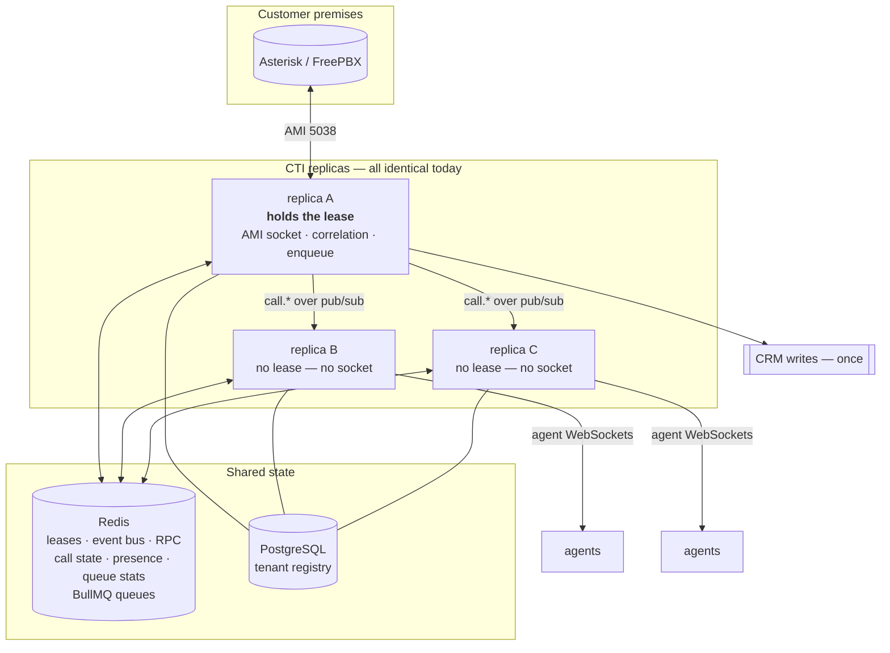
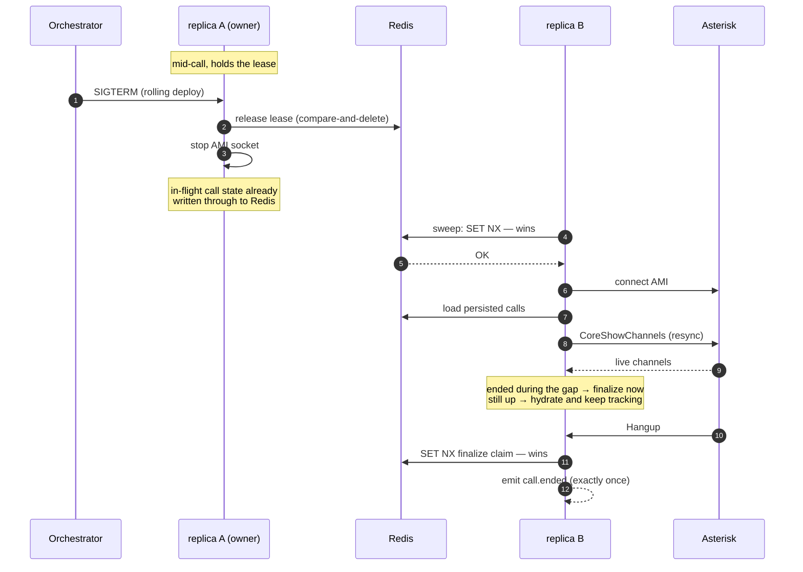
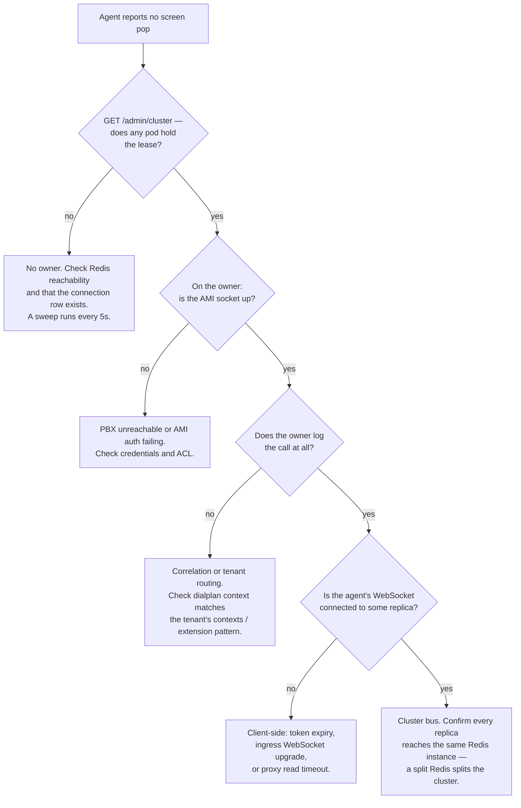

# Running More Than One Replica

Operator guide for horizontal scale. Design rationale is in [ADR-0012](./adr/0012-single-writer-ownership-for-horizontal-scale.md) (ownership) and [ADR-0013](./adr/0013-cluster-event-bus-and-exactly-once-enqueue.md) (event bus); this page is about running and debugging it.

> **Before Phase 12, running two replicas silently corrupted CRM data.** Every replica opened its own AMI socket to every PBX, ran its own correlation engine, and enqueued its own delivery job — so one call produced two Zoho calls, two Salesforce Tasks, two signed webhooks. If you are on an older build, run one replica.

## The one rule that makes it work

**A PBX connection is driven by exactly one replica at a time.** That replica is the sole source of `call.*` events for its PBX, and the only one that enqueues delivery. Everything else follows from it.

Ownership is a **Redis lease** — a key holding the pod's identity under a 30-second TTL, renewed every 10s, released on `SIGTERM`. Renewal is a compare-and-swap against the pod id, so a process that has been away longer than the TTL can never reclaim ownership someone else has taken. Losing a lease stops that connection immediately.



Replicas are interchangeable for HTTP and WebSocket traffic. Only PBX ownership is exclusive.

## What is shared, and where

| State | Where | Why it matters |
|---|---|---|
| PBX ownership | `cti:lease:{ami\|files}:{connectionId}` | the exclusivity guarantee |
| Call state | `call:{connectionId}:{callId}`, 6h TTL | `GET /v1/calls` correct cluster-wide, survives restarts |
| Finalize claim | `cti:finalized:{connectionId}:{callId}`, 5m TTL | `call.ended` fires exactly once |
| Agent presence | `cti:presence:{tenantSlug}` hash, 24h TTL | `GET /v1/agents/state` same answer on every replica |
| Queue/ACD stats | `cti:qstats:{connectionId}:{queue}`, 24h TTL | wallboard survives an ownership handover |
| Delivery jobs | BullMQ queues | already cluster-safe — Redis-side job locking |
| Rate limits | throttler storage | per-tenant originate limit correct across replicas |
| Tenant registry | PostgreSQL, cached in memory per pod | refreshed on boot and on `POST /admin/reload` |

**Redis is now a correctness dependency, not a cache.** Leases live there. Run it HA (Sentinel or a managed service) before production — this is the real cost of the design.

## Configuration

| Variable | Default | Notes |
|---|---|---|
| `POD_ID` | hostname + random suffix | Identity used for leases. In Kubernetes the hostname is the pod name, which is already unique; the random suffix additionally distinguishes a *restarted* pod from its predecessor, so a stale lease never looks self-owned. Override only if you know why. |
| `LEASE_TTL_MS` | `30000` | How long a crashed pod's connections stay orphaned. Lower = faster failover, more Redis traffic. |
| `LEASE_RENEW_MS` | `10000` | Renewal cadence. Must stay comfortably below the TTL. |
| `CLUSTER_RPC_TIMEOUT_MS` | `15000` | Cross-pod command timeout. Deliberately longer than the 10s AMI action timeout so the PBX's own error message wins instead of a generic timeout. |

Everything else is unchanged — every replica gets the identical environment.

## Observing ownership

The first question in a cluster is always *"why is this PBX down on this pod?"*, and the usual answer is *"it isn't — another pod owns it."*

```bash
curl -s -H "X-Admin-Key: $ADMIN" http://replica-a:3000/admin/cluster
```

```json
{
  "thisPod": "cti-7d9f-abc123",
  "owned": [],
  "leases": [
    { "kind": "ami", "connectionId": "a858…", "podId": "cti-5b2c-def456", "ttlMs": 25156 }
  ]
}
```

- `thisPod` — who is answering.
- `owned` — connections **this** replica is actually driving. Empty is normal and healthy.
- `leases` — cluster-wide ownership, with time left on each lease.

`GET /health` reports only the connections *this* pod owns, so a replica holding none reports `degraded`. **Do not use `/health` as a Kubernetes probe** — use `/health/ready`, which checks Postgres and Redis and is the only endpoint that returns a failing status code.

## Handover and failover



- **Graceful shutdown** (`SIGTERM`): the lease is released immediately, so a peer picks the connection up on its next sweep — about 5 seconds. Verified live.
- **Hard kill** (`SIGKILL`, node failure): nobody releases anything, so the connection is orphaned until the lease TTL expires — up to 30 seconds. Calls in flight are not lost: state is in Redis and the new owner resyncs against `CoreShowChannels`.
- **Reverse connections behave differently on purpose.** The customer's connector agent dials out and lands wherever the load balancer puts it. That pod force-claims ownership, because the connection can only be served where the socket physically is. The previous holder — which has no tunnel — stands down.

## Troubleshooting



**Duplicate CRM records.** Should be impossible. If you see them, check in this order: (1) `GET /admin/cluster` — is more than one pod listing the same connection under `owned`? That means two Redis instances, not one cluster. (2) Are all replicas on the same build? A pre-Phase-12 replica does not respect leases.

**Wallboard or presence looks wrong on one replica only.** Both read from Redis, so a divergence means that replica is talking to a different Redis.

**A connection flaps between pods.** Usually `LEASE_RENEW_MS` too close to `LEASE_TTL_MS`, or Redis latency high enough that renewals miss. Widen the gap.

## Verifying it yourself

```bash
# Two replicas against one PBX, plus a webhook receiver
WEBHOOK_SECRET=receiver-a-secret node scripts/webhook-receiver.mjs 4000 &
POD_ID=pod-A npm start &
PORT=3002 POD_ID=pod-B npm start &

# Place one call, then count deliveries — must be exactly 1 of each
grep -c call.ended  # against the receiver's output
```

Full scenarios, including ownership handover and cross-pod reads, are in [TESTING.md §M](./TESTING.md).

## Roles (Phase 12b)

One image; `CTI_ROLE` selects what a process takes on. All four values are valid deployments — `all` is genuinely the union of the other three, not a fourth code path.

| `CTI_ROLE` | Runs | Scale it on |
|---|---|---|
| `connector` | PBX sockets, correlation, **and the delivery producers** | number of PBX connections |
| `api` | HTTP, agent WebSockets, admin, recordings | `cti_softphone_clients`, CPU |
| `worker` | BullMQ processors only | queue depth |
| `all` *(default)* | everything | dev, compose, single-node |

Every role listens on `PORT` — `connector` and `worker` still answer `/health/live`, `/health/ready` and serve `/metrics`. Only `api` serves the tenant API and Swagger; the others return 404 for those routes, which is expected rather than a fault.

**Producers live with the emitter.** The dispatchers load only on `connector`, which is what keeps the enqueue exactly-once: the replica that derives an event is the only one that can queue it.

### Scale signals

| Metric | Per-pod? | Drives |
|---|---|---|
| `cti_softphone_clients` | yes — `sum()` for the cluster total | `api` |
| `cti_http_requests_total` / `_duration_seconds` | yes | `api` |
| `cti_leases_held` | yes | connector spread; `0` on an api replica is normal |
| `cti_active_calls` | yes | capacity |
| `cti_queue_jobs` | **no — global** | `worker`. Aggregate with `max()`; `sum()` multiplies by replica count |

## Deploying on Kubernetes

Phase 12a made replicas *safe*. Two pieces of the plan remain:

Nothing. Phases 12a–12c are complete: replicas are safe, the roles are split, and [deploy/helm/cti](../deploy/helm/cti) deploys and autoscales them. See [INSTALL §15](./INSTALL.md).
