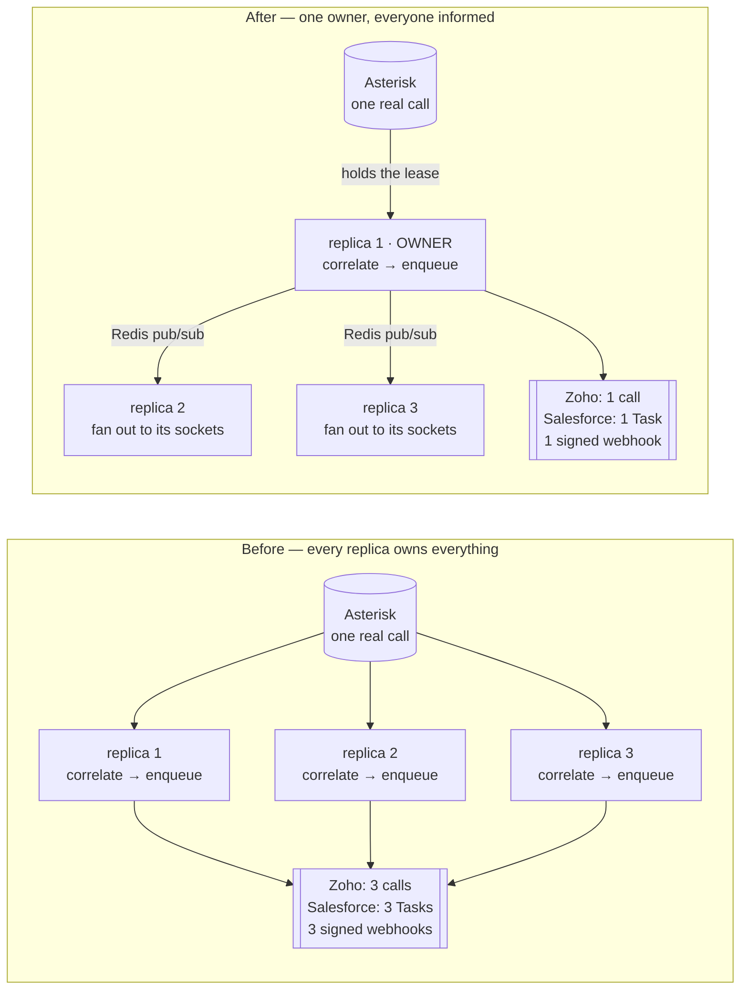
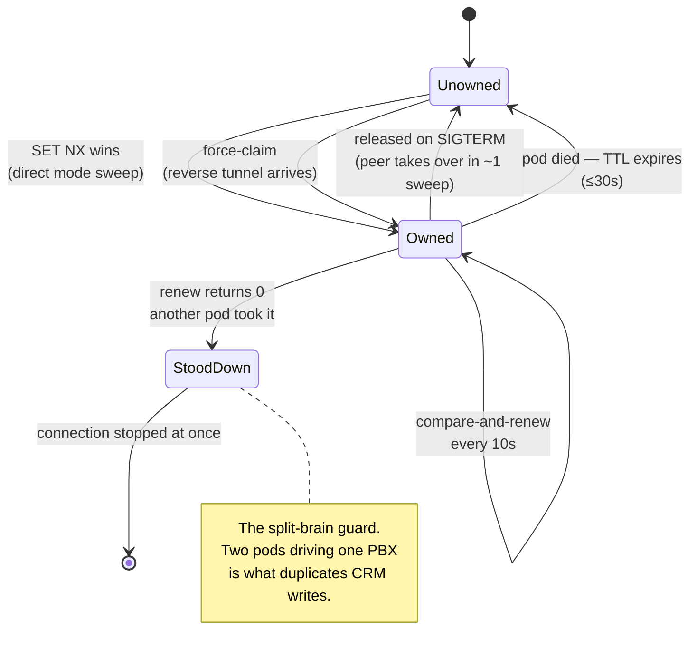

# ADR-0012 — Single-writer ownership via Redis leases

**Status:** Accepted · Phase 12a · 2026-07-26

## Context

Every replica opened its own AMI socket to every PBX in the registry. `PbxSupervisorService.reload()` iterated `registry.allConnections()` unfiltered and started them all, and nothing anywhere in `src/` did leader election, locking, or sharding.

That is not a performance problem. It is a data-integrity one. AMI is a broadcast firehose: each replica received the same events, ran its own correlation engine, derived its own `call.ended`, and enqueued its own delivery job with a fresh `randomUUID()` — so BullMQ could not dedupe them either.

**Measured on the lab with two replicas, before this change: one call produced two of every webhook and two of every CRM write.** Three replicas would produce three. The ARI path was worse still: `AriConnection` does not merely observe, it answers channels, plays prompts, sets variables and hands calls back to the dialplan, so N replicas ran that control flow N times against one live channel.

A second problem hid behind the first, and would have surfaced the moment it was fixed. `SoftphoneGateway.push()` only ever iterated *its own* process's sockets, and `EventEmitter2` is in-process. Agents received screen pops **only because** every replica independently derived the events. Introducing single ownership without a distributed bus in the same change would have silently stopped every screen pop — the two bugs masked each other.

## Decision

**A PBX connection is driven by exactly one replica at a time, and ownership is a Redis lease.**

A lease is a key holding the pod's identity under a short TTL (`cti:lease:{kind}:{connectionId}`, 30s), renewed on a timer and released on `SIGTERM`. Renewal and release are Lua compare-and-swap against the pod id, so a process that has been away longer than the TTL can never resurrect ownership another pod has taken. Losing a lease stops the connection immediately — that callback is the split-brain guard.

Three supporting pieces, all in `src/cluster/`:

| Piece | Solves |
|---|---|
| `LeaseService` | who may drive a PBX |
| `ClusterBusService` | events reaching the pod that holds an agent's WebSocket |
| `ClusterRpcService` | requests reaching the pod that holds a PBX socket |

**Ownership is acquired differently for the two connection modes**, because they are not symmetric:

- **`direct`** — lease-first (`SET NX`). Any pod can dial the PBX, so whoever claims it first wins.
- **`reverse`** — **tunnel-first.** The customer's connector agent dials out and lands wherever the ingress puts it. That pod's claim is authoritative because the connection can only be served where the socket physically is; it force-claims and the previous holder — which has no tunnel — stands down.

`kind` separates `ami` from `files`, because a connector agent opens `/connector-ws` and `/connector-files` as two sockets that may land on different pods.

### Exactly-once is enforced in two places, not one

Ownership alone is insufficient, and this is the subtle part.

1. **Enqueue.** Mirrored events are re-emitted on *every* pod so agent sockets fan out. A pod that merely *received* an event must not enqueue delivery for it — otherwise the bus reintroduces exactly the duplication the lease removed. Events crossing the bus are tagged with a `Symbol` (invisible to `JSON.stringify`, so it can never leak into a webhook body), and every dispatcher skips tagged payloads. **This was not theoretical: it was observed live and fixed after ownership was already working.**

2. **`call.ended`.** A lease handover can briefly leave two pods holding the same call — the outgoing owner mid-hangup and the incoming one having hydrated it from Redis. Finalisation therefore takes a `SET NX` claim key.

That claim is a *separate* key rather than "did our `DEL` remove the snapshot", because persistence is fire-and-forget: a snapshot that had not landed yet would make `DEL` report 0 and **silently swallow a real call log**. A Redis failure resolves in favour of emitting. A duplicated CRM record can be cleaned up by hand; a missing one is invisible.

### Registry changes fan out

`POST /admin/reload` now broadcasts over the bus instead of mutating one pod. Previously the other replicas kept serving stale API keys — answering 401 for a newly created tenant, while their delivery workers dropped its jobs *silently* (a missing tenant returns job success, not a retry).

## Consequences

- **Redis is now a correctness dependency, not a cache.** Leases live there. It must be HA (Sentinel or managed) before production. This is the significant cost of the decision.
- Ownership is observable: `GET /admin/cluster` reports which pod holds each lease and how long it has left. Without it, "why is this PBX down?" is unanswerable in a cluster — the honest answer is usually "it isn't, another pod owns it".
- A pod crash orphans its connections for up to one lease TTL. Graceful shutdown releases immediately, so a rolling deploy hands over in about one sweep (~5s); only a hard kill waits out the TTL.
- Every pod still runs BullMQ workers. That was already correct — Redis-side job locking makes consumption exactly-once. **The producer side was the bug, never the consumer side.**
- **No idempotency keys were added, deliberately.** Single-owner enqueue makes them unnecessary; a dedupe layer would be redundant machinery hiding the real invariant.
- `PbxSupervisorService` gained a second job — routing commands to the owning pod — so `api` replicas can serve click-to-call and coaching for a PBX they do not hold. Phase 12b splits the roles properly.
- Fixed in passing: `reload()` did not filter `driver === 'ari'` the way `AriSupervisorService` does, so ARI rows also got an AMI client pointed at the ARI HTTP port. That was a bug at N=1 too.

## Verification

- **Live, two replicas, one lab call: exactly 1 webhook per event type** (`call.ringing`, `call.answered`, `call.ended`), down from 2 before the fix. Only one pod held an AMI socket and only one ran the correlation engine.
- **Live handover:** `SIGTERM` the owner → the peer acquired and connected within one sweep. `GET /admin/cluster` showed `owned: []` on the non-owner with the lease attributed to its peer.
- **Live fan-out:** one `POST /admin/reload` to pod A reloaded the registry on both pods.
- **Automated (92 tests):** lease acquire / renew-only-if-owner / no-steal-while-held / release-on-shutdown / independent `ami` and `files` leases, against real Redis; RPC routing to the owner, silence from non-owners, error-text propagation, unknown-method rejection; bus delivery, no echo, AMI firehose staying local, marker never serialized; and two pods finalizing one call emitting `call.ended` once.

## Deferred to 12b, honestly

`PresenceService` and `QueueStatsService` still hold per-pod in-memory state, so `GET /v1/agents/state` and `GET /v1/queues` answer from whichever replica serves the request. That is *divergent*, not *corrupting* — no CRM record is wrong — which is why it ranked below the duplication work. Both move to Redis hashes in 12b.
