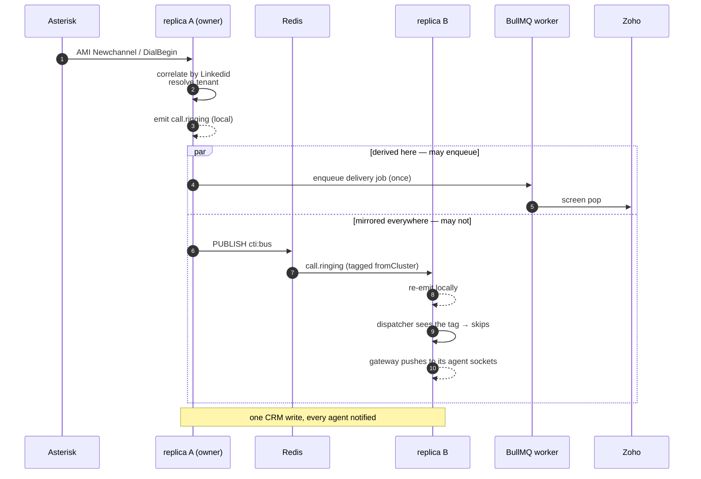

# ADR-0013 — Cluster event bus, and who may enqueue delivery

**Status:** Accepted · Phase 12a · 2026-07-26

## Context

[ADR-0012](./0012-single-writer-ownership-for-horizontal-scale.md) gives each PBX connection exactly one owning replica. That fixes duplication at the source, but it breaks something else and leaves one thing unfixed.

**It breaks screen pops.** `EventEmitter2` is in-process. `SoftphoneGateway.push()` only ever iterated its own process's sockets. Before ownership, agents received events because *every* replica independently derived them from its own AMI socket — the delivery worked by accident, as a side effect of the duplication bug. Give a connection a single owner and the pod holding an agent's WebSocket is almost never the pod that derived the event. **The two bugs masked each other**, and fixing ownership alone would have silently stopped every screen pop with nothing in the logs.

**It leaves duplication unfixed.** Once events cross to other replicas, every replica's dispatchers see them again. Ownership says who may *derive* an event; it says nothing about who may *act* on one. This was not theoretical — it was measured live after ownership was already working: one AMI socket, one correlation engine, and still **two distinct delivery jobs per event**.

## Decision

**Mirror a whitelist of events over Redis pub/sub onto every replica's local emitter, and let only the pod that *derived* an event enqueue delivery for it.**

One channel, `cti:bus`. The publisher tags each message with its pod id; a pod ignores its own echo. On receipt the payload is re-emitted on the local `EventEmitter2`, so **every existing `@OnEvent` consumer keeps working untouched** — the gateway, presence, metrics. No consumer knows the event came from another host.

### Three choices worth recording

**Whitelist, not everything.** Only `call.`, `agent.`, `queue.` and `cluster.` prefixes cross. `ami.event` is excluded deliberately: it is a per-connection firehose of raw AMI frames, meaningful only to the pod holding that socket. Mirroring it would put every PBX's full event stream through Redis and re-run correlation on replicas that have no business doing it.

**A `Symbol` marker, not role gating.** The rule "only the deriving pod enqueues" is enforced by tagging mirrored payloads with a `Symbol` that all five dispatchers check.

The alternative was to rely on the 12b role split, loading dispatchers only on `connector` pods. Rejected: it would have left single-process mode (development, the compose stack, and every deployment before 12b) broken, and it encodes the invariant in *deployment topology* rather than in the code — a config mistake would silently reintroduce duplicate CRM writes. A `Symbol` is also invisible to `JSON.stringify`, so the marker can never leak into a webhook body or a CRM payload. The two mechanisms compose: after 12b the dispatchers will not be loaded on API pods *and* would still refuse a mirrored event.

**Transparent mirroring, not explicit publish calls.** `ClusterBusService` hooks `onAny` rather than requiring each emitter to call `publish()`. Fewer call sites to keep in step, and a new mirrored event needs no plumbing — at the cost of one whitelist that must be kept honest.

### Events became self-contained

`CallAnsweredEvent` gained `agentExt` (`CallEndedEvent` already carried it). That let **both** per-call routing maps be deleted — `SoftphoneGateway.callRoutes` and `PresenceService.callAgents`. Those existed only to recover which agent a `callId` belonged to, by remembering the earlier `call.ringing`.

Per-call memory on a receiving replica is exactly wrong in a cluster: a pod that never saw the ringing — the normal case now — would drop the follow-up events. Self-contained events mean any replica can act on any event, which is also what lets the API tier scale independently in 12b.

## Consequences

- **Every replica does the fan-out work for every tenant**, filtering to its own sockets. Fine at this scale; if the bus ever becomes hot, shard by tenant rather than reintroducing per-pod routing state.
- **One Redis channel is a single ordering domain.** Events from different connections interleave, which nothing depends on — each consumer keys by `callId`.
- **A replica on a different Redis is a silently split cluster.** Its agents get no events from elsewhere, and it may duplicate CRM writes because it sees no leases. The first check in [SCALING.md](../SCALING.md) troubleshooting.
- **The whitelist is a maintenance obligation.** A new cross-replica event that is not prefixed `call.`/`agent.`/`queue.`/`cluster.` will silently stay local. Same class of standing rule as ADR-0010's "register every new queue with the admin controller and metrics collector".
- Publishing is fire-and-forget; a failed publish is logged, not retried. It affects live UI only — the durable path (BullMQ) is unaffected, and `GET /v1/calls` reads Redis directly.

## Verification

- **Live, two replicas:** exactly 1 webhook per event type for one call, down from 2 before the marker was added — with only one AMI socket in both cases, isolating this from the ownership fix.
- **Automated:** a call event raised on pod A arrives on pod B; a received event is *not* republished (no ping-pong); `ami.event` never crosses; and the marker never survives `JSON.stringify`, asserted against the serialized payload rather than the object.
- **Cross-pod reads:** a replica owning no connections returns byte-identical `/v1/agents/state` and `/v1/queues` to the owning replica.
